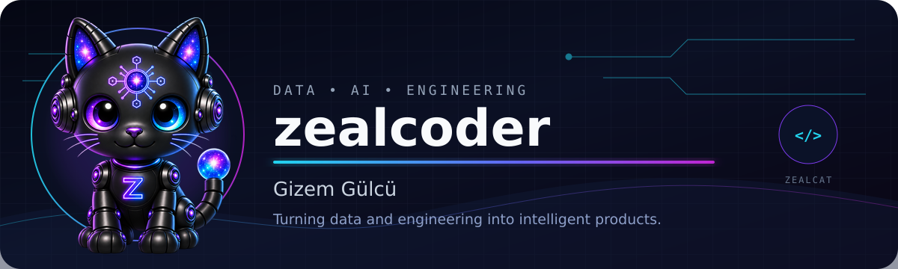
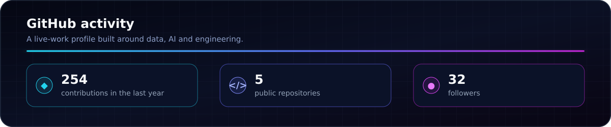

  

<h3 align="center">Data Scientist • Electrical & Electronics Engineer • AI Builder</h3>

  I turn data, engineering thinking and machine learning into clear, useful products. 
  Currently building <strong>ZealCat</strong>, my AI-powered portfolio companion.

  
  
  

  

### What I build

| | |
|---|---|
| **◆ Data products** Analysis that ends with a decision, not just a chart. | **◇ Machine learning** Reproducible workflows with clear evaluation. |
| **✦ AI experiences** Approachable interfaces that make intelligent systems useful. | **⬡ Engineering solutions** Structured problem solving shaped by my EEE background. |

> Open to **Junior Data Scientist** and **Machine Learning Engineer** opportunities.

  

### Featured work

| Project | Focus and outcome | Stack | Explore |
|---|---|---|---|
| **ZealCat AI Portfolio** | Context-aware AI companion, polished web experience and personal product design | JavaScript · HTML · CSS · Vercel | [Repository](https://github.com/zealcoder95/zealcoder-portfolio) · [Live](https://zealcoder-portfolio.vercel.app/) |
| **E-commerce SQL Analytics** | Business-focused querying and structured analysis of commerce data | T-SQL · SQL analytics | [Repository](https://github.com/zealcoder95/ecommerce-sql-project) |
| **NYC High School Data** | Data cleaning, exploratory analysis and communicating relationships in education data | Python · Pandas · Jupyter | [Repository](https://github.com/zealcoder95/Analyzing-NYC-High-School-Data) |

<strong>More data projects and case studies</strong>

 

| Project | Focus | Explore |
|---|---|---|
| **Adana Energy & Climate** | Energy generation, emissions, seasonality and forecasting | [Kaggle](https://www.kaggle.com/code/gizemglc/global-climate-change-renewable-energy-in-adana) |
| **Adidas US Sales Analysis** | Sales trends, product performance and regional insights | [Kaggle](https://www.kaggle.com/code/gizemglc/adidas-us-sales-analysis) |
| **Employee Exit Surveys** | Data cleaning and analysis of employee dissatisfaction | [Kaggle](https://www.kaggle.com/code/gizemglc/clean-and-analyze-employee-exit-surveys-1-1) |
| **Kaggle Notebooks** | Complete collection of applied data projects | [View all](https://www.kaggle.com/gizemglc/code) |

  

### Core toolkit

  
  
  
  
  
  
  

  

### GitHub activity

  

  

  <strong>Adana, Türkiye</strong> · Building at the intersection of data, AI and engineering. 
  Explore the work, test ZealCat, or connect with me on LinkedIn.

